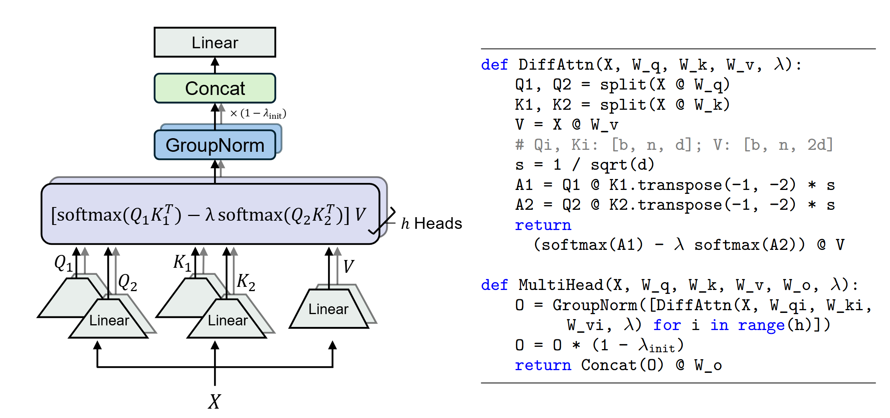
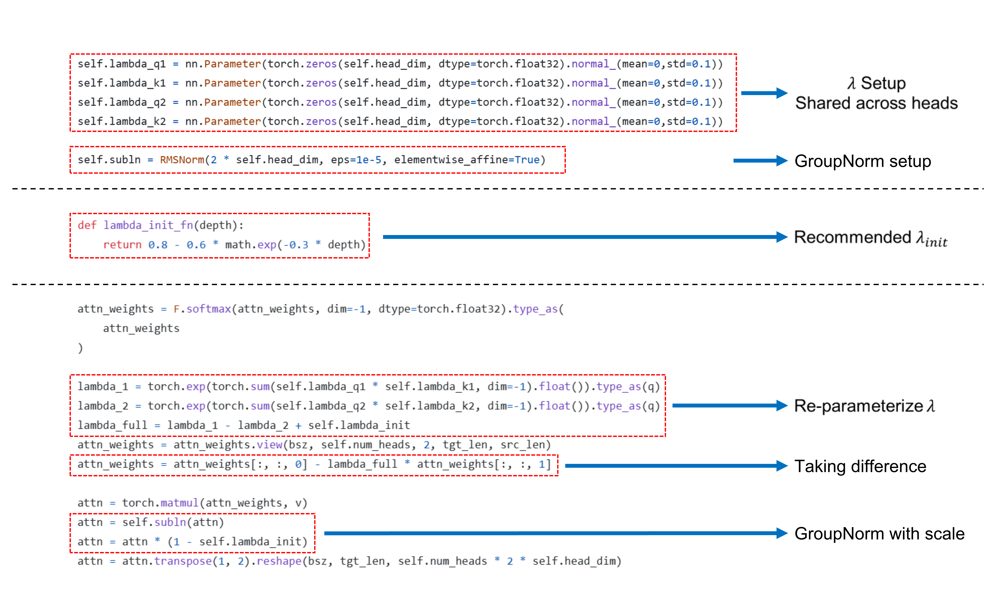

Forked from Microsoft's Differential Transformer

https://github.com/microsoft/unilm/tree/master/Diff-Transformer

# Introspective Attention:

For input $X \in \mathbb{R}^{n \times d}$ and $i \in \{1,2,3\}$:

$P_i = \{Q_i, K_i, V_i, A_i\}$

where:

$A_i = \text{LayerNorm}(\text{softmax}(Q_iK_i^T/\sqrt{d_k})V_i)$

$\tilde{K_i},\tilde{V_i} = \text{concat}(P_0...P_{i-1})$ &nbsp; &nbsp; # dims: $\mathbb{R}^{n \times (i(d_k + d_v))}$

$\lambda_i = \text{LayerNorm}(\text{sigmoid}(w_{\lambda_i}))$ &nbsp; &nbsp; # Stabilized weights

$\text{Output} = \text{LayerNorm}(\sum(\lambda_iA_i) + \alpha X)$ &nbsp; &nbsp; # Residual connection

**Key properties:**
1. Path[$i$] has parallel access to Path[0...$i$-1]
2. Dimensionality preserved through projections
3. Gradient and scale stabilized

# Differential Transformer
## Approach

  

## Contents
`multihead_diffattn.py` contains naive implementation of multi-head differential attention.

`multihead_flashdiff_1.py` contains multi-head differential attention implemented with FlashAttention, for packages that support different qk/v dimensions (e.g., our [customized-flash-attention](https://aka.ms/flash-diff) and [xformers](https://github.com/facebookresearch/xformers)). **(Recommended for faster training and inference)**

`multihead_flashdiff_2.py` contains multi-head differential attention implemented with FlashAttention, for packages that **do not** support different qk/v dimensions (e.g., [flash-attention](https://github.com/Dao-AILab/flash-attention)).

Also refer to [PR](https://github.com/microsoft/unilm/pull/1633) for another implementation.

We recommend using models with a sufficiently large number of heads to minimize the impact of halving heads. For instance, using Diff Transformer with more than 8 heads (the minimum used in the paper, with the same number of parameters as Transformer with 16 heads) is advisable.

## Core Code 

  

